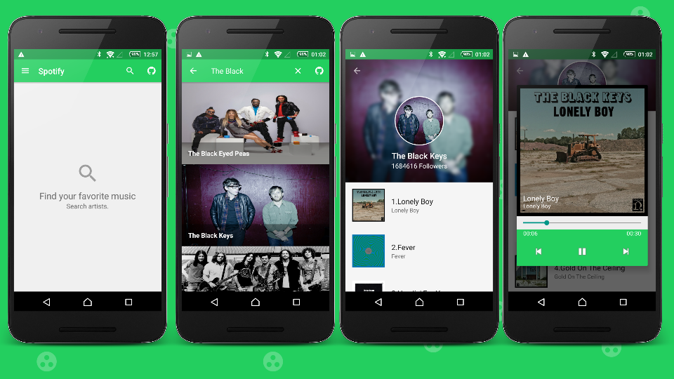
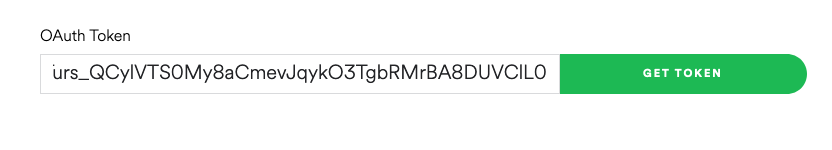

# Android - Spotify + Model View Presenter (MVP) 
Android Model View Presenter used to explain how to use this pattern in our android applications.

This example was created to support an article explanation [Model View Presenter en Android][1] (spanish).

Libraries used on the sample project
------------------------------------
* [AppCompat, CardView, RecyclerView, Material][2]
* [Retrofit 2][4]
* [RxJava & RxAndroid][5]
* [Gradle Retrolambda Plugin][6]

# Demo

# Access Token 

The Spotify Api has been changed an Access Token is required. The app sample probably will response `401 unauthorized code`.

1- * Get Your Access Token from [Spotify Api Doc](https://developer.spotify.com/web-api/console/get-search-item/)

2- The class `Constans` has a constant variable called `ACCESS_TOKEN` replace with your access token  

3- Run the app, it should work!!

# how does it work?

[8]: http://mockito.org/
[7]: http://robolectric.org/
[6]: https://github.com/evant/gradle-retrolambda
[5]: https://github.com/ReactiveX/RxAndroid
[4]: http://square.github.io/retrofit/
[2]: http://developer.android.com/intl/es/tools/support-library/index.html
[1]: https://erikjhordan-rey.github.io/blog/2015/11/02/ANDROID-mvp.html

Do you want to contribute?
--------------------------

Feel free to report or add any useful feature, I will be glad to improve it with your help, before submitting your code please check the [codestyle](https://github.com/square/java-code-styles).

Developed By
------------

* Erik Jhordan Rey  - <erikjhordan.rey@gmail.com>

License
-------

    Copyright 2016 Erik Jhordan Rey

    Licensed under the Apache License, Version 2.0 (the "License");
    you may not use this file except in compliance with the License.
    You may obtain a copy of the License at

       http://www.apache.org/licenses/LICENSE-2.0

    Unless required by applicable law or agreed to in writing, software
    distributed under the License is distributed on an "AS IS" BASIS,
    WITHOUT WARRANTIES OR CONDITIONS OF ANY KIND, either express or implied.
    See the License for the specific language governing permissions and
    limitations under the License.

